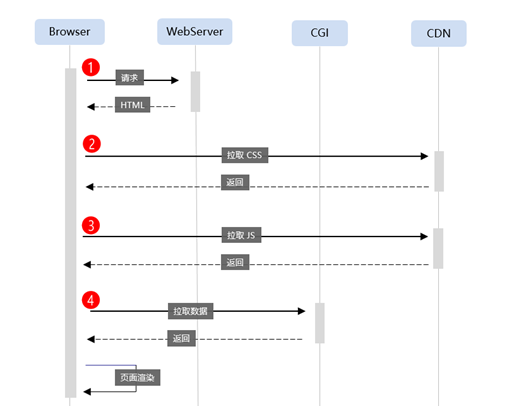
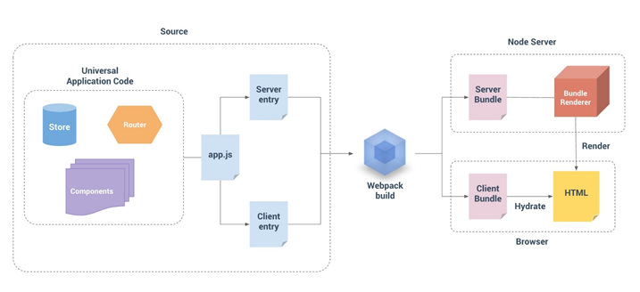
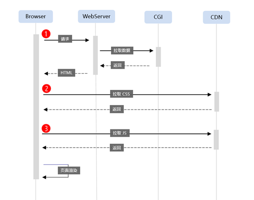
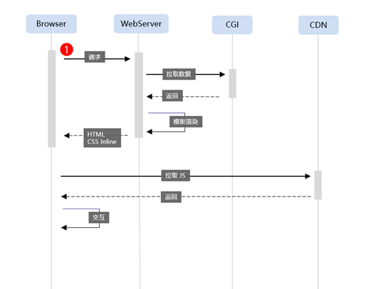

# 1. 什么是SSR
Server Side Render的缩写，及服务端渲染。服务端渲染的主要流程：
- 用户向服务器发起请求
- 服务器获取请求后进行数据处理(静态页面则不需要数据处理)，将数据插入到html 等dom元素构建出响应界面
- 将网页内容返回给浏览器端

# 2. 与传统Java服务端渲染区别
java的服务端渲染分为了几个阶段。
- 阶段一：静态页面
- 阶段二： response.write()方法拼写页面返回
- 阶段三：带有模板的服务端脚本输出，例如jsp
- 阶段四：前后端分离的服务端框架盛行：Struts
- 阶段五： 富客户端占主导的JS时代-angular，vue, react等

# 3. 为何再次需要SSR
当我们编译项目的时候，总是从客户端开始渲染。而现在由于一些原因，需要从服务端渲染了了。<br>
- 搜索引擎不友好：为了更好的SEO
- JS文件加载等待越来越久：提高性能<br>
传统的SPA加载模式如下：<br>
<br>
因此，为了解决这个问题，出现了`Isomorphism/Universal Javascript Development`的概念，这依赖于nodejs的功劳。<br>
<br>
通过SSR的实现方式，页面加载模式变成了下面的方式:<br>
<br>
还可以将css也在服务端进行处理，更加优化的SSR加载模式如下:<br>
<br>

# 4. React SSR
- 利于SEO：React服务器渲染的方案使你的页面在一开始就有一个HTML DOM结构，方便Google等搜索引擎的爬虫能爬到网页的内容。
- 提高首屏渲染的速度：服务器直接返回一个填满数据的HTML，而不是在请求了HTML后还需要异步请求首屏数据
- 前后端都共用代码，提供开发效率
- 摒弃Template,以组件方式组织代码

# 4.1 React SSR API
React SSR提供了一些API,可以和React-router, Redux进行配合，渲染首屏。`renderToString`和`renderToStaticMarkup`都用于将`Virtual DOM`渲染成HTML字符串。<br>
- renderToString: 将React Component转化为HTML字符串。
- renderToStaticMarkup：同样是将React Component转化为HTML字符串，但是生成HTML的DOM不会有额外属性，从而节省HTML字符串的大小。
```javascript
import {renderToString} from 'react-dom/server';
const html = renderToString(
    <Provider store={store}>
        <RouterContext {...renderProps}/>
    </Provider>
)
```

# 4.2 渲染原理
- 15版本：服务端渲染出来的只是静态DOM，还不能使用State, props,事件等，必须在客户端实例化React,而在客户端渲染之前会根据DOM结果和props计算组件的checksum值，然后与服务端渲染结果中的checksum进行比较，如果相同则不会重新渲染该组件，而如果不想同，则会重新渲染，并抛出错误。当没有找到checksum值时，也会重新渲染。<br>
- 16版本：
1. 支持stream
1. 构建时去掉了多余的process.env（在node环境访问这个变量很耗时）访问
1. client不再计算checksum，而是尽量复用现有DOM

这里需要注意一个问题，要将renderToString渲染出来的DOM用额外的div包裹起来，不然会导致checksum不同,因此在`模板`文件中需要如下处理：
```html
<div id="container"><div>${html}</div></div>
```
# 4.3 和Redux配合
为了和Redux配合使用，服务端的Redux需要按照如下步骤进行处理:<br>
- 为每次请求创建全新的Redux store实例,并将准备的初始化数据设置到store对象
- 从 store 中取出 state
- 把 state 一同返回给客户端
- 在template方法里将初始state挂在window上，方便客户端渲染用

```javascript
// server.js
function serverDeal(req, res, next) {
    ....
    const store = configureStore(initStore);
    const html = renderToString(
            <Provider store={store}>
                <StaticRouter />
            </Provider>
        )
        // 从 store 中取出 state
    const finalState = store.getState();
        // 把 state 一同返回给客户端
    res.end(template(html,finalState));
}


//template.js 
function template(html, store) {
    return `
        <html>
            ...
            window.__INITIAL_STATE__ = ${JSON.stringify(initState)}
            ...
        </html>
    `
}

// client.js
const initState = window.__INITIAL_STATE__;
const store = configureStore(initState);
ReactDOM.render(
    <Provider store={store}>
       <Router history={browserHistory}>
        {routesApp}
       </Router>
    </Provider>,
    document.getElementById('container'));

```

# 4.4 React-router配合
使用`StaticRouter`处理服务端路由。
```javascript
// routes.js
<Switch>
<Route exact path="/notice" component={NoticeViewContainer} />
<Route exact path="/notice/detail" component={NoticeViewContainer} />
<Route exact path="/update" component={UpdateViewContainer} />
<Route exact path="/update/detail" component={UpdateViewContainer} />
</Switch>

// SSR 
import { StaticRouter } from 'react-router-dom';
const store = configureStore(await getPreStore(req.path, next));
let initView = (
    <Provider store={store}>
        <StaticRouter location={req.url} context={context}>
            { Routes }
        </StaticRouter>
    </Provider>
);
```
# 5. css 坑
当在SSR后端热启动的过程中，css会解析不了。需要额外的处理。
- 安装
```javascript
 cnpm install css-modules-require-hook --save
```
- 编写配置文件cmrh.conf.js文件(需要与webpack配置文件的一致)
```javascript
module.exports = {
    generateScopedName: '[name].[local]'
  };
```
- 在服务端server.js引入css配置进行代码改造。[csshook必须放在第一行，代码初始化的时候先引入css]
```javascript
// 处理css
import csshook from 'css-modules-require-hook/preset';
```
# 6. 图片资源坑
服务端还没有处理图片问题。
- 安装
```javascript
cnpm install asset-require-hook --save 
```
- 改造服务端server.js代码
```javascript
// 处理图片
import assethook from 'asset-require-hook';
```
# 7. SSR webpack 配置注意点
- 需要安装 webpack-node-externals 包，在编译过程中用于忽略node_moudule。需要在配置文件中设置externals属性
```javascript
import nodeExternals from 'webpack-node-externals';
...
externals: [nodeExternals()]
```
- target: webpack 默认的编译target为web,用于浏览器环境。这里我们需要在node环境中运行
```javascript
target: node
```
- entry: 需对SSR设置入口文件。
```javascript
entry: path.resolve(__dirname, '..', 'src/server/index.js')
```
- output: path 和publicPath参数可以一样。除此之外，需要设置两个额外的参数。`library`和`libraryTarget`,将我们的入口文件暴露给外面的世界。
```javascript
library: 'myLibName', // 我们的library 名称叫做 myLibName
libraryTarget: 'commonjs2', // 定义我们的library如何暴露给外面的世界。在node环境中，module.exports时默认的。
```
- module: 服务端不需要给我们产生任何的资产文件，资产文件应该是由客户端产生的。因此对于`file-loader`,`url-loader`需要追加`?emitFile=false`。对于样式loader，使`css-loader?locals`替换。如果有其他样式loader,可以不使用。

# 8. 服务端渲染
- https://w3ctech.com/topic/2005
